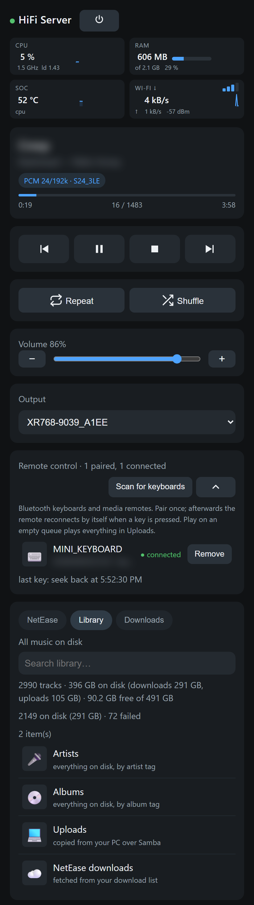
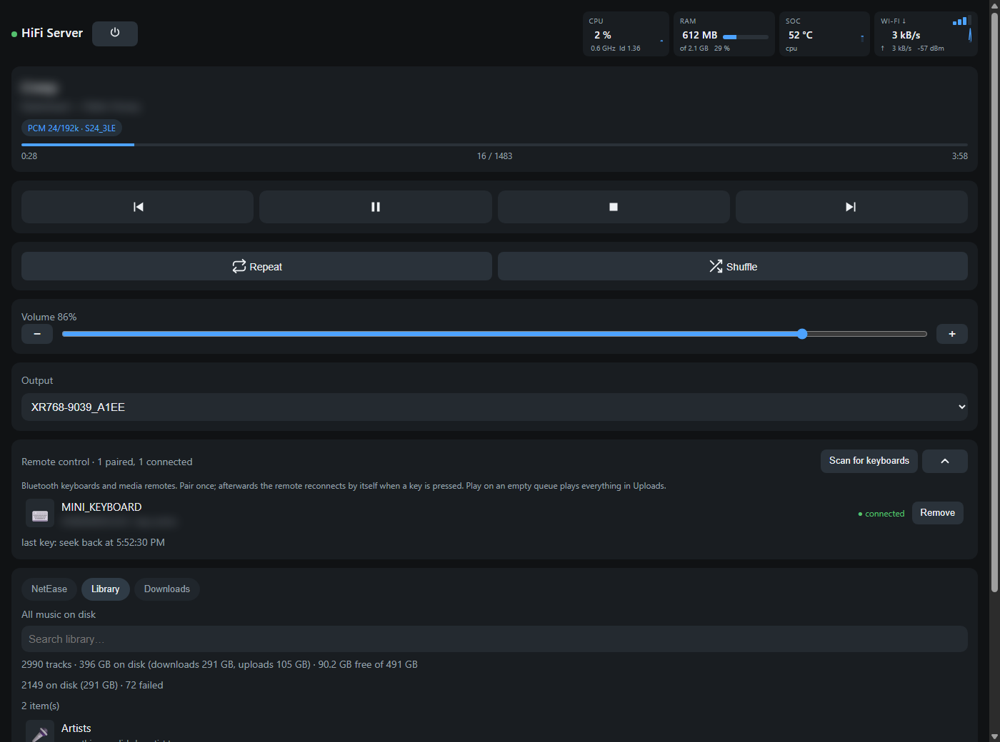
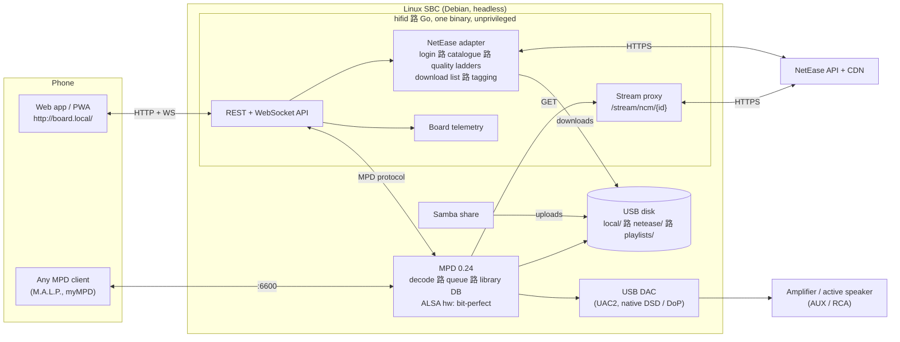

# HiFi-NetEase-Server

**A headless HiFi music server for a small Linux board (Orange Pi, Raspberry Pi, any Debian SBC)
that plays 缃戞槗浜戦煶涔?/ NetEase Cloud Music and your own FLAC/DSD files bit-perfect through a
USB DAC into any speaker or amplifier, controlled from your phone.**

Keywords, so you can tell whether you are in the right place: NetEase Cloud Music 路 缃戞槗浜戦煶涔?路
Linux 鎾斁鍣?路 headless music server 路 Orange Pi Zero 3 路 Raspberry Pi 路 Armbian 路 Debian 路
arm64 路 riscv64 路 MPD 路 bit-perfect 路 USB DAC dongle 路 ES9039Q2M 路 ES9038 路 CS43131 路 native DSD 路
DoP 路 DSD256 路 24/192 路 Hi-Res 路 鏃犳崯 路 瓒呮竻姣嶅甫 (jymaster) 路 FLAC 路 SACD ISO 路 Samba 路 PWA remote
control 路 Bluetooth remote 路 BLE keyboard 路 Go.

| Phone | Desktop browser |
|---|---|
|  |  |

## What it does

- **Plays your NetEase library on Linux, logged in with your own account** (QR-code login from the
  NetEase phone app, no password on the server). Playlists, liked songs, daily picks, catalogue
  search. Streams live at lossless; adds tracks to a download list that fetches the best quality
  your account grants (瓒呮竻姣嶅甫 masters at 24-bit/192 kHz on SVIP), tags them, and plays them
  from disk afterwards. Files are plain FLAC/MP3, not the desktop client's encrypted format.
- **Plays your own music** dropped onto a Samba share from Windows Explorer or macOS Finder:
  FLAC, ALAC, WAV, AIFF, APE, WavPack, MP3, AAC, Vorbis, Opus, DSF, DFF, DTS. SACD disc images
  (.iso) are extracted to DSF from the web app with one tap.
- **Bit-perfect.** MPD talks to the DAC through ALSA `hw:` with no mixer or resampler in the
  path. Native DSD where the kernel allows it, DoP otherwise, DSD-to-PCM as the last resort. The
  phone shows the format the DAC really receives ("PCM 24/192k 路 S24_LE", "DSD256 native").
- **Controlled from a phone** through a web app served by the board itself (installable as a
  PWA), plus any MPD client (M.A.L.P., myMPD, Cantata) against the same queue.
- **Or from a Bluetooth remote.** Pair any BLE mini keyboard or media remote once, from the web
  app; afterwards it reconnects by itself when switched on. Play/pause, next, previous, volume,
  seek with the arrows; play on an empty queue starts the local library. No phone needed.
- **Runs unattended.** One Go binary and MPD as systemd services, auto-start on boot, Wi-Fi
  watchdog, board telemetry in the header (CPU, RAM, SoC temperature, Wi-Fi), a power-off button.
- **Small.** About 20 MB RSS for the service, 65 MB for MPD, idle CPU under 2 % on a
  quad-core Cortex-A53 at 480 MHz.

## 涓枃绠€浠?
鍦ㄩ姗欐淳 / 鏍戣帗娲剧瓑 Debian 寮€鍙戞澘涓婅繍琛岀殑鏃犲ご HiFi 闊充箰鏈嶅姟鍣細鐢ㄨ嚜宸辩殑缃戞槗浜戦煶涔愯处鍙凤紙鎵爜鐧诲綍锛?鎾斁姝屽崟銆佹垜鍠滄鐨勯煶涔愩€佹瘡鏃ユ帹鑽愶紝鍦ㄧ嚎鎾斁鐢ㄦ棤鎹燂紝涓嬭浇鍒楄〃鎸夎处鍙锋潈闄愬彇鏈€楂橀煶璐紙SVIP 鍙緱
24bit/192kHz 瓒呮竻姣嶅甫锛夛紝涓嬭浇鐨勬槸鏅€?FLAC/MP3 鏂囦欢锛涘悓鏃舵挱鏀鹃€氳繃 Samba 鍏变韩鎷峰叆鐨勬湰鍦伴煶涔?锛堝惈 DSD锛夈€侻PD 鐩存帴璧?ALSA `hw:` 杈撳嚭鍒?USB 瑙ｇ爜鍣紙DAC锛夛紝鍏ㄧ▼ bit-perfect锛屾敮鎸佸師鐢?DSD /
DoP锛涙墜鏈烘祻瑙堝櫒鎵撳紑寮€鍙戞澘鍦板潃鍗冲彲鎺у埗銆傜‖浠剁ず渚嬶細Orange Pi Zero 3锛? GB锛? ES9039Q2M USB
瑙ｇ爜灏忓熬宸?+ 浠讳綍甯?AUX 杈撳叆鐨勯煶绠憋紝浣嗕换浣?Debian 寮€鍙戞澘鍜屼换浣?USB Audio Class 2 瑙ｇ爜鍣ㄩ兘閫傜敤銆?
## How it works

Three rules keep the design small (details in [docs/03 搂11](docs/03-solution-architecture.md)):

1. **MPD is the only process that touches audio.** It decodes, keeps the queue, indexes the disk
   and writes to the DAC. It knows nothing about NetEase.
2. **`hifid` (Go) is the only process that talks to NetEase.** It holds the session, resolves
   stream URLs, downloads and tags files, and serves the phone app and REST/WebSocket API.
3. **The bridge between them is a URL.** A NetEase track not on disk goes into MPD's queue as
   `http://127.0.0.1/stream/ncm/<id>`, and MPD fetches it back from `hifid` like a web radio
   stream. A track on disk goes in as a file path.


```mermaid
flowchart LR
    subgraph Phone
        PWA["Web app / PWA<br/>http://board.local/"]
        MPDC["Any MPD client<br/>(M.A.L.P., myMPD)"]
    end
    subgraph Board["Linux SBC (Debian, headless)"]
        subgraph hifid["hifid 路 Go, one binary, unprivileged"]
            API["REST + WebSocket API"]
            NCM["NetEase adapter<br/>login 路 catalogue 路 quality ladders<br/>download list 路 tagging"]
            PROXY["Stream proxy<br/>/stream/ncm/{id}"]
            SYS["Board telemetry"]
        end
        MPD["MPD 0.24<br/>decode 路 queue 路 library DB<br/>ALSA hw: bit-perfect"]
        SMB["Samba share"]
        DISK[("USB disk<br/>local/ 路 netease/ 路 playlists/")]
        DAC["USB DAC<br/>(UAC2, native DSD / DoP)"]
    end
    NET["NetEase API + CDN"]
    SPK["Amplifier / active speaker<br/>(AUX / RCA)"]

    PWA <-->|HTTP + WS| API
    MPDC <-->|:6600| MPD
    API --> NCM & SYS
    API <-->|MPD protocol| MPD
    MPD -->|GET| PROXY
    PROXY <-->|HTTPS| NET
    NCM <-->|HTTPS| NET
    NCM -->|downloads| DISK
    SMB -->|uploads| DISK
    MPD --> DISK
    MPD --> DAC --> SPK
```

Playing a NetEase track, end to end: the phone posts `ncm:<id>` to the queue; `hifid` checks its
download index; if there is no local copy it adds the proxy URL to MPD with the title, artist and
album as tags; MPD requests the URL; `hifid` asks NetEase for the CDN URL at the best *streaming*
level, pipes the bytes through with the `Content-Type` corrected (the CDN mislabels FLAC as MPEG),
8 MB of read-ahead against Wi-Fi jitter; MPD decodes and plays. The download list uses a second,
higher ladder because a file has no deadline.

## Hardware

Nothing in the code or the installer is tied to one board or one DAC. Disks are addressed by
label, DACs by USB vendor/product id, the Wi-Fi watchdog is installed only when the default route
is wireless, and the DSD kernel quirk only when a DAC advertises raw DSD that the kernel did not
enable. The reference build is one example:

| Part | Reference build (tested) | Anything else that works |
|---|---|---|
| Board | Orange Pi Zero 3, Allwinner H618, 2 GB, Debian 12 vendor image, kernel 6.1 | Any Debian-based SBC with 鈮?512 MB RAM and a USB 2.0 host port: Raspberry Pi 3/4/5, Orange Pi 3/5/RV, Radxa, Banana Pi, NanoPi; arm64 or riscv64 |
| DAC | USB-C dongle with ES9039Q2M and a Comtrue bridge (`2fc6:f802`): PCM to 768 kHz, native DSD to DSD256 verified | Any USB Audio Class 2 DAC or dongle. Native DSD depends on the bridge chip (XMOS, Comtrue, Savitech), see the table in the [manual 搂8](docs/USER-MANUAL.md#8-dsd-what-to-expect-per-dac-class); DoP and PCM work everywhere |
| Speaker / amp | Marshall Acton IV over 3.5 mm AUX | Anything with a line input; the dongle's headphone output drives it at 100 % volume |
| Music storage | 512 GB microSD in a USB reader, ext4 | USB flash drive or SSD. Plug it into the board's own USB port; a card reader on an expansion header fell back to USB 1.1 |
| Network | 2.4 GHz Wi-Fi, ~5 Mbit/s usable | Ethernet or 5 GHz Wi-Fi removes the streaming ceiling; the design is offline-first so weak Wi-Fi only slows downloads |
| Remote | A 7-key BLE mini keyboard (play/pause, prev, next, vol 卤, 鈫?鈫? | Any Bluetooth keyboard or media remote the kernel sees as a HID device; the board's own Bluetooth (UWE5622 on the Zero 3) or a USB dongle |
| NetEase account | SVIP (masters) | Any account: the quality ladder follows what the account is granted (standard 鈫?320k 鈫?lossless 鈫?Hi-Res 鈫?master) |

## Quick start

On the board, from a fresh Debian image:

```sh
git clone https://github.com/Zulolo/HiFi-NetEase-Server.git && cd HiFi-NetEase-Server
sudo deploy/scripts/install.sh --disk /dev/sda1 --format     # packages, disk, DAC detection, MPD, Samba, mDNS
sudo deploy/scripts/test-audio.sh                             # proves the bit-perfect path, prints what the DAC receives
cd server && go build -o dist/hifid ./cmd/hifid && cd ..     # Go 1.24+; or cross-compile on your PC
sudo deploy/scripts/install-hifid.sh --binary server/dist/hifid
```

Then open `http://<hostname>.local/` on your phone, tap **Log in with QR code**, scan it with the
NetEase app, and your playlists appear. Drop music onto `\\<hostname>\music` from the PC. The
[user manual](docs/USER-MANUAL.md) has every step, the variants (no separate disk, several DACs,
no Samba) and troubleshooting.

## Repository layout

```
docs/          design documents 00鈥?2, ADRs, user manual, screenshots (start with docs/00-overview.md)
server/        hifid, Go: MPD adapter, NetEase adapter + stream proxy, download list, REST/WS API, embedded PWA
deploy/        install scripts, mpd.conf template, udev rules, systemd units, polkit rule, backup script
tools/         bench helpers (DSD test-file generator, measurement scripts)
```

## Documentation

| Read this | When you want |
|---|---|
| [User manual](docs/USER-MANUAL.md) | to build one |
| [03 路 Architecture, 搂11 "As built"](docs/03-solution-architecture.md) | to understand how hifid, MPD and NetEase fit together |
| [04 路 Audio pipeline, DSD, DACs](docs/04-audio-pipeline-dsd-dac.md) | native DSD vs DoP, kernel quirks, volume policy, per-chip behaviour |
| [08 路 NetEase integration](docs/08-netease-integration-design.md) | login, quality ladders, why the proxy pipes instead of redirecting, rate limits |
| [05 路 Hardware evaluation](docs/05-hardware-evaluation-and-calculations.md) | bit-rate, USB, storage, RAM and power budgets; board comparison |
| [09 路 API](docs/09-api-design.md) | to write your own client |
| [11 路 Roadmap](docs/11-roadmap-and-milestones.md) | what is done, what was dropped and why, lessons learned along the way |

## Status

Daily-use complete (September 2026): NetEase login, playlists, liked songs, daily picks, search,
live streaming, download list with pause/resume and stall recovery, tagging, Samba uploads,
folder/artist/album browsing, output switching, telemetry, power-off, backup script, SACD ISO
extraction, Bluetooth remote control. Open:
long soak test, per-DAC output manager for multi-DAC setups, native Android app (optional).

## Contributing: add your board or DAC

The most useful contribution is a report of what works on hardware we have not seen. Open an
issue with:

```sh
lsusb; uname -r; cat /etc/os-release | head -2
sudo deploy/scripts/probe-dac.sh          # DAC formats the kernel exposes, incl. DSD_U32_BE
sudo deploy/scripts/test-audio.sh         # what the DAC received for 44.1/96/192 kHz and DSD
```

and the tables in the manual and docs/04 get a new row. Code contributions: Go for `hifid`,
plain HTML/JS for the web app (no build step), shell for the installer; keep the three rules above.

## Built on

[MPD](https://www.musicpd.org/) 路 [chaunsin/netease-cloud-music](https://github.com/chaunsin/netease-cloud-music)
(Go NetEase API) 路 [gompd](https://github.com/fhs/gompd) 路 [myMPD](https://jcorporation.github.io/myMPD/) 路
[M.A.L.P.](https://f-droid.org/packages/org.gateshipone.malp/) 路 [go-musicfox](https://github.com/go-musicfox/go-musicfox)
(used as the interim NetEase client before `hifid` existed). Not affiliated with NetEase; use your own account within its terms.

## Licence

MIT, see [LICENSE](LICENSE).
