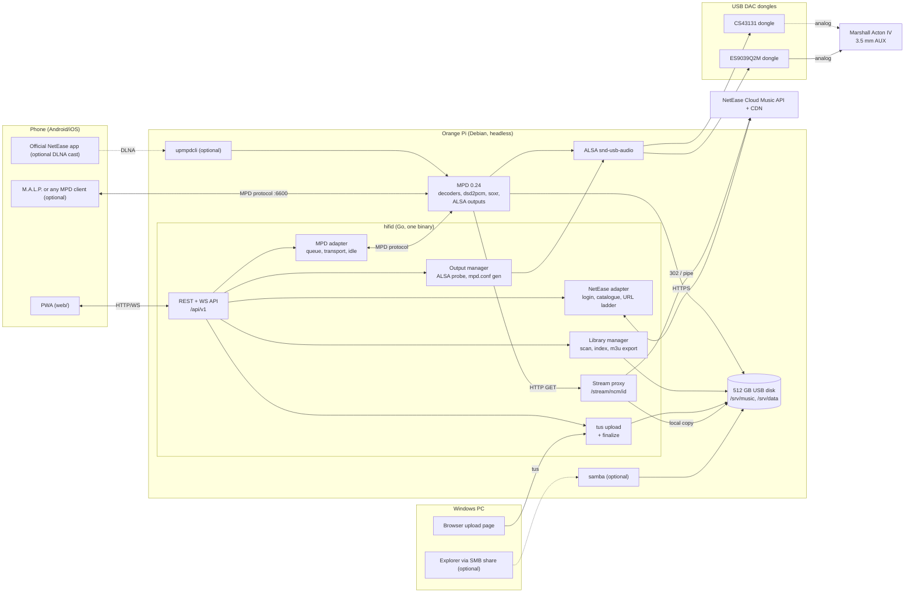
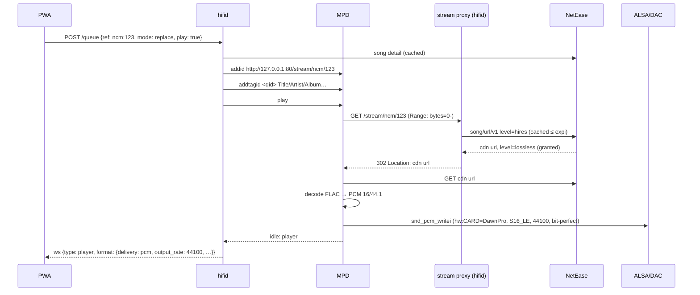
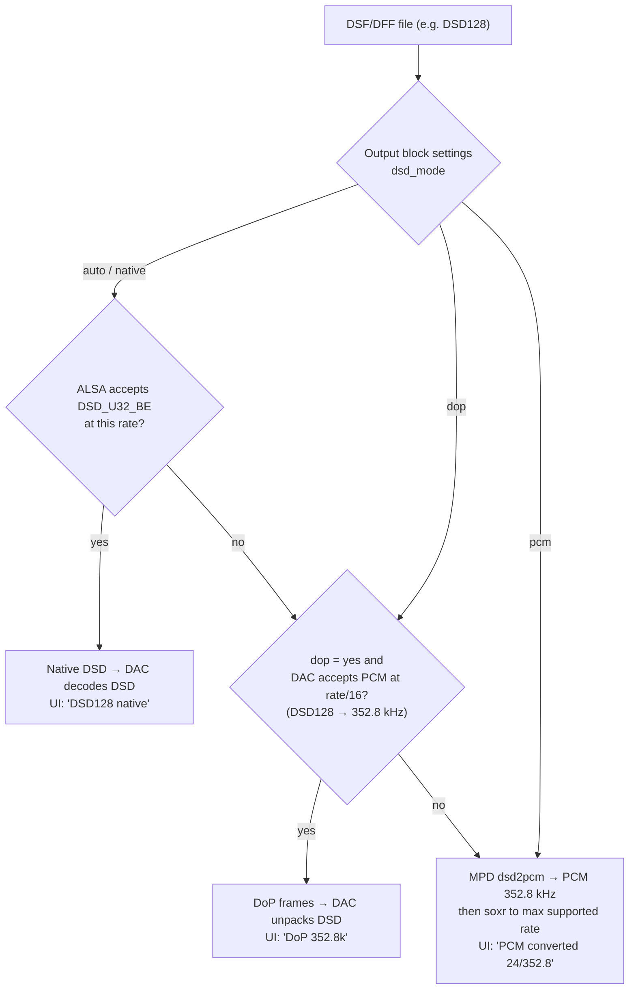
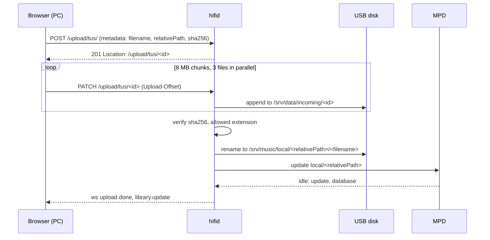

# 03 · Solution and Architecture

Status: draft v0.1 · 2026-09-13 · addresses all FR/NFR in docs/01

## 1. Solution in one paragraph

Build the server from one proven open-source playback engine, **Music Player Daemon (MPD)**,
which already does bit-perfect ALSA output, native DSD / DoP / DSD-to-PCM fallback, every
required codec, multiple switchable outputs, a play queue, a local library database and a
network protocol with dozens of existing phone clients. Add **one custom Go service,
`hifid`**, that (a) logs into NetEase Cloud Music with the owner's account and turns the
owner's NetEase library into things MPD can play through a local stream proxy, (b) offers a
REST + WebSocket API and a mobile-first **PWA** for control, browsing, output selection and
downloads, (c) accepts resumable multi-file uploads into the local library, and (d) probes the
attached USB DACs to generate MPD's output configuration. Everything runs headless on Debian
(riscv64 on the Orange Pi RV, arm64 from the same sources), with MPD and the PWA usable on day 1
and the NetEase and native-app layers added in phases (docs/11).

Why not the alternatives (details in docs/02 and the ADRs):

| Alternative | Why not as the core |
|-------------|---------------------|
| Official NetEase Linux client on a desktop session | Closed source, x86_64/UOS desktop only, needs a display, no remote control API, heavy for 1 GB RAM, not on riscv64. |
| go-musicfox alone (TUI NetEase client with MPD/mpv engine) | Excellent proof that the API works on ARM, and it is the recommended **interim tool**, but it is a terminal UI: no phone control, no upload, no output management. |
| Mopidy + a NetEase backend | Python + GStreamer, ~2× the RAM, weaker DSD story, the NetEase backend is unmaintained. |
| Volumio / moOde / piCorePlayer images | Raspberry Pi centred; no Orange Pi RV support; no NetEase source; would have to be forked anyway. |
| Phone-only path (NetEase app casting via DLNA to `upmpdcli`) | Kept as an *optional add-on* on top of MPD, but the server itself would not be logged in, no downloads, no offline. |

## 2. Component view



## 3. Responsibilities

| Component | Owns | Does not own |
|-----------|------|--------------|
| **MPD** | Decoding all formats, DSD delivery mode, resampling fallback, gapless, ALSA output blocks, hardware mixer, queue state, local library DB, stored playlists, MPD protocol for third-party clients. | NetEase knowledge, HTTP upload, UI. |
| **hifid / NetEase adapter** | Session, catalogue, quality ladder, stream proxy, downloads with tagging, playlist export to `.m3u`. | Playing audio. |
| **hifid / MPD adapter** | Translating REST calls to MPD commands, `idle` event fan-out to WebSocket, `addtagid` metadata for remote songs, active output switching. | Format decisions. |
| **hifid / Output manager** | Enumerating USB audio cards (udev/sysfs), probing capabilities (`/proc/asound/card*/stream0`, ALSA hw_params), stable ids per dongle, rendering `mpd.conf` output blocks, orchestrating MPD restart when a block changes, hot-plug events. | Choosing DSD vs PCM at play time (MPD does that from the block's settings). |
| **hifid / Library manager** | Paths on the USB disk, `update` triggers, duplicate detection, recent-additions view, index SQLite. | Tag editing (out of scope; beets/Picard on the PC). |
| **hifid / Upload** | tus endpoint, hash verification, finalize into library. | Transcoding (never). |
| **PWA** | All user interaction on the phone and the PC upload page. | State (always fetched from the API; WebSocket keeps it live). |
| **Debian/systemd** | Boot ordering (disk mount → mpd → hifid), restarts, RT priority for MPD, LAN-only binding. | |

## 4. Runtime view: play a NetEase song



## 5. Runtime view: play a DSD file with fallback



MPD implements this chain itself: the ALSA output plugin tries the DSD format, then DoP when
`dop "yes"`, and otherwise falls back to PCM conversion. `hifid` only sets the per-output
options from the probe (docs/04) and reports what happened (`format.delivery`).

## 6. Runtime view: upload from the PC



## 7. Deployment view (single board)

| Unit | Runs as | Ports | Notes |
|------|---------|-------|-------|
| `srv-hifi.mount` (+ bind mounts `srv-music.mount`, `srv-data.mount`) | root | | 512 GB disk (ext4, `noatime`) mounted at `/srv/hifi`; `/srv/music` (music) and `/srv/data` (index, caches, incoming) are bind mounts of its subdirectories, so uploads finalize with an atomic rename. |
| `mpd.service` | `mpd` (audio group) | 6600 (LAN) | drop-in: `After=srv-music.mount`, `LimitRTPRIO=50`, `LimitMEMLOCK`. Config generated by `hifid` into `/etc/mpd.conf` from a template plus per-DAC blocks. |
| `hifid.service` | `hifid` (audio group, read access to `/proc/asound`) | 80 (LAN), 8081/udp (discovery) | `After=mpd.service`, `Restart=always`, env file with the API token and encryption secret. |
| `avahi-daemon` | | 5353/udp | `_hifid._tcp`, `_http._tcp`, and host `.local` name. |
| `samba` (default) | | 445 | share `/srv/music/local` for Explorer drag-and-drop, the owner's primary import path; `hifid` watches the tree with inotify and triggers MPD updates. |
| `upmpdcli` (optional) | | 49152 | Exposes MPD as a DLNA/OpenHome renderer for the official NetEase phone app. |
| No PulseAudio / PipeWire | | | Not installed on the server image; MPD talks to `hw:` devices directly. |

Filesystem layout on the USB disk:

```
/srv/music/
├── local/          uploads and SMB drops (FR-3)
├── netease/        downloads from NetEase (FR-1.5), <AlbumArtist>/<Album>/<NN - Title>.ext
└── playlists/      MPD stored playlists; NetEase/*.m3u regenerated by hifid
/srv/data/
├── mpd/            MPD database, state, sticker db
├── hifid/          index.sqlite, netease/session.json (0600), covers/
└── incoming/       tus temporary files
```

## 8. Architecture-level decisions

| ADR | Decision |
|-----|----------|
| ADR-0001 | MPD is the playback engine; `hifid` never touches samples. |
| ADR-0002 | `hifid` is a single Go binary; the NetEase adapter is an interface over an open-source API implementation. |
| ADR-0003 | PWA first for phone control; MPD protocol stays open for third-party clients; native Android app optional later. |
| ADR-0004 | Uploads use the tus resumable protocol; SMB is the documented alternative. |
| ADR-0005 | DSD strategy: native → DoP → dsd2pcm, chosen per output block; hardware mixer or fixed volume for bit-perfect DSD. |
| ADR-0006 | Output selection = MPD outputs enable/disable with generated per-DAC blocks and udev-stable card names. |
| ADR-0007 | Primary target board and OS image. |
| ADR-0008 | NetEase streams are piped through `hifid` with a corrected `Content-Type`, not 302-redirected. |

## 9. Quality attributes mapped to design

| NFR | Design element |
|-----|----------------|
| NFR-1 bit-perfect, no dropouts | MPD → ALSA `hw:` only; `auto_resample/format/channels "no"`; larger ALSA buffer; MPD output thread RT priority; no desktop sound server. |
| NFR-2 boot ≤ 60 s | systemd ordering; MPD DB on the disk; `hifid` starts serving before NetEase login completes. |
| NFR-3 ≤ 300 MB | MPD ≈ 30–80 MB with a 20k-song DB; `hifid` Go binary ≈ 30–60 MB RSS; no Node/Python at runtime. |
| NFR-4 arm64 + riscv64 | MPD, ALSA, ffmpeg, samba, avahi from Debian; `hifid` cross-compiled with `GOARCH=arm64|riscv64`. |
| NFR-5 LAN-only | Bind to LAN interface; token for admin calls; stream proxy bound to 127.0.0.1 by default. |
| NFR-6 isolation | NetEase adapter behind interface; failures produce typed errors; local playback independent. |
| NFR-7 observability | `/system/status`, structured logs via journald, `format.delivery` badge. |
| NFR-8 data safety | Service never deletes music; uploads finalize by rename; duplicates kept. |

## 10. What is *not* in the architecture (and why)

- No transcoding server for the phone (the phone controls, it does not stream).
- No database server (SQLite file suffices for the index; MPD keeps its own DB).
- No reverse proxy required (nginx only if TLS is wanted for PWA install; docs/06).
- No container runtime (Debian packages + one binary is simpler on 1 GB boards).
