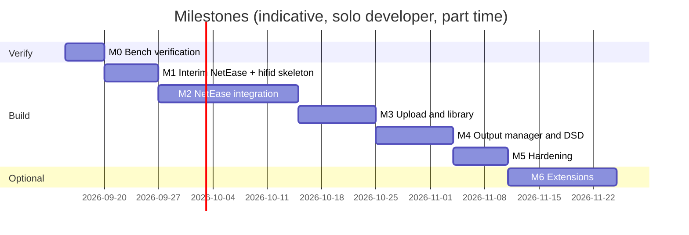

# 11 · Roadmap and Milestones

Status: draft v0.1 · 2026-09-13

Each milestone ends in something the owner can use on the real speaker. Effort is a rough
solo-developer estimate; hardware verification steps are explicit because DAC behaviour on
Linux can only be confirmed on the actual dongles.

## M0 · Bench verification (no custom code) · ~2 evenings

Goal: prove the audio path on the chosen board before writing anything.

1. Flash Debian (image choice per ADR-0007), attach USB disk, one DAC, LAN.
2. `apt install mpd mpc alsa-utils ffmpeg`; run `deploy/scripts/probe-dac.sh` on every dongle:
   record VID:PID, ALSA card name, `/proc/asound/cardX/stream0` formats, native DSD flag,
   supported rates. Fill the table in docs/04 §7.
3. Hand-written `mpd.conf` with one `hw:` output; play FLAC 16/44, 24/96, 24/192, DSD64,
   DSD128 from the disk with `mpc`; note delivery mode per dongle (native/DoP/PCM).
4. Run `deploy/scripts/bench-dsd.sh`: CPU % for dsd2pcm and for soxr on this CPU;
   write results into docs/05 §"Measured on hardware".
5. Install M.A.L.P. on the phone, control MPD on port 6600: play/pause/volume/outputs.

Exit criteria: 24 h of 24/192 PCM playback without dropouts; each dongle's best DSD mode known.

## M1 · NetEase via MPD, interim tools · ~1 week

Goal: listen to the NetEase library on the Acton IV from the phone, using existing software.

1. Build/install **go-musicfox** on the board (Go, arm64/riscv64), configure `mpd` engine,
   QR login, play own playlists from an SSH terminal (Termux/JuiceSSH on the phone). This
   validates the NetEase API from the board's IP and the account's quality entitlement.
2. Start the `hifid` skeleton: config, MPD adapter, `/api/v1/player` + `/queue`, WebSocket
   events, minimal PWA with now-playing/transport/volume/outputs.
3. Deploy units from `deploy/systemd`, udev names from `deploy/udev`.

Exit criteria: phone PWA controls MPD; NetEase playable through go-musicfox.

## M2 · Native NetEase integration in `hifid` · ~2–3 weeks

1. NetEase adapter (ADR-0002 library), QR login, session persistence.
2. Stream proxy `/stream/ncm/{id}` with redirect mode, URL cache, `addtagid` metadata.
3. Catalogue endpoints + PWA screens: playlists, liked, daily, search, cloud disk.
4. Playlist export to `playlists/NetEase/*.m3u` (extm3u) so M.A.L.P. sees them.
5. Download jobs with tagging and index; proxy prefers local copies.

Exit criteria: FR-1 acceptance test passes; go-musicfox no longer needed.

## M3 · Upload and library · ~1–2 weeks

1. tus endpoint, finalize pipeline, hash verification, duplicate warning.
2. Upload page in the PWA (drag-and-drop folders, parallel chunks, resume after reload).
3. Library screens (artists/albums/folders/recent), `update` triggers, cover art.
4. Optional samba share and documentation for SMB/SFTP paths.

Exit criteria: FR-3 acceptance test (4 GB DSF folder) passes.

## M4 · Output manager and DSD polish · ~1–2 weeks

1. ALSA probe → capability JSON per dongle; stable ids from VID:PID:serial.
2. `mpd.conf` generation with per-DAC blocks (dsd_mode, volume_mode, max_rate),
   controlled MPD restart, hot-plug via udev → `hifid` → rescan.
3. `format.delivery` reporting (native/DoP/converted) from MPD status + ALSA hw_params.
4. Volume policy per output (hardware/fixed), UI feedback.

Exit criteria: FR-4 and FR-5 acceptance tests pass on at least one ES9039Q2M and one CS43131 dongle.

## M5 · Hardening · ~1 week

1. 72 h soak test, RAM/CPU profile against NFR-3, boot-time measurement (NFR-2).
2. Token auth, LAN binding audit, cookie encryption, log rotation.
3. Backup/restore of `/srv/data/hifid` and the MPD DB; disk-full behaviour.
4. Install script `deploy/scripts/install.sh` for a fresh Debian image on both boards.

## M6 · Optional extensions (pick by value)

| Extension | Value | Effort |
|-----------|-------|--------|
| Native Android app (Kotlin or Capacitor wrapper) with media-session lock-screen controls and NSD discovery | Convenience | 2–3 weeks |
| `upmpdcli` DLNA renderer so the official NetEase app can cast to the server | Guests, zero-login use | 1 evening |
| Lyrics (NetEase lyric endpoint) in the PWA | Nice | 2 days |
| Simultaneous outputs (FR-5.6) | Rare | 1 day (MPD already supports) |
| Home Assistant `mpd` integration | Automations | 1 hour |
| Second source (e.g. QQ 音乐) behind the same source interface | Future | unknown |

## Dependencies and ordering

M0 must come first: the DAC probe results decide how much of M4 is needed (if all dongles do
native DSD out of the box, M4 shrinks to configuration generation).
