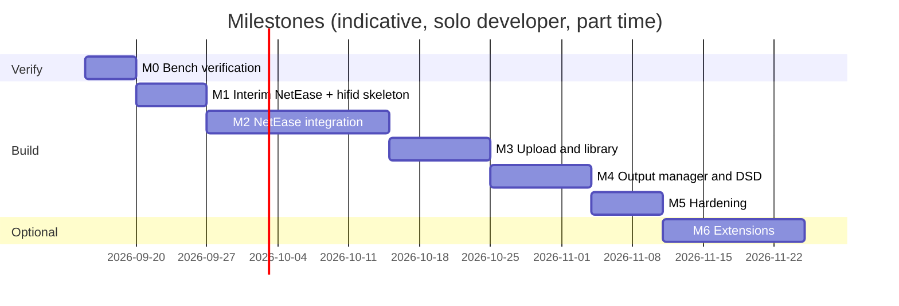

# 11 · Roadmap and Milestones

Status: draft v0.1 · 2026-09-13

Each milestone ends in something the owner can use on the real speaker. Effort is a rough
solo-developer estimate; hardware verification steps are explicit because DAC behaviour on
Linux can only be confirmed on the actual dongles.

## M0 · Bench verification · done 2026-09-24 on an Orange Pi Zero 3 (2 GB)

Result: `deploy/scripts/install.sh` brings a fresh Debian 12 board to a working bit-perfect
MPD server with Samba and Avahi in one run; the Comtrue/ES9039 dongle plays PCM to 768 kHz
and native DSD64/128 (after the installer's kernel quirk); everything survives a reboot
(details in ADR-0007 and docs/05 §11). Still running: the 24 h Wi-Fi and playback soak.

Original plan, kept for readers repeating it on other hardware:

0. Record each dongle's `lsusb` ID (docs/12 Q13) and make sure the board has a port for the
   disk and one for the DAC (hub or header ports if needed), a heatsink and its rated supply.
1. Flash the distribution image, check the music disk with `f3probe`, attach it and the
   DAC, join Wi-Fi with power save off. Run `deploy/scripts/install.sh` (it enables the
   watchdog timer when the default route is wireless).
2. `apt install mpd mpc alsa-utils ffmpeg samba`; run `deploy/scripts/probe-dac.sh` on every dongle:
   record VID:PID, ALSA card name, `/proc/asound/cardX/stream0` formats, native DSD flag,
   supported rates. Fill the table in docs/04 §7.
3. Hand-written `mpd.conf` with one `hw:` output; play FLAC 16/44, 24/96, 24/192, DSD64,
   DSD128 from the disk with `mpc`; note delivery mode per dongle (native/DoP/PCM).
4. Run `deploy/scripts/bench-dsd.sh`: CPU % for dsd2pcm and for soxr on this CPU;
   write results into docs/05 §"Measured on hardware".
5. Install M.A.L.P. on the phone, control MPD on port 6600: play/pause/volume/outputs.
6. Thresholds (ADR-0007): 24 h Wi-Fi log (ping loss, outage length, `iperf3` every hour) and
   24 h DSD128/24-192 local playback while a 500 MB album is copied over Samba; record RAM
   headroom. Optionally install `upmpdcli` and test the NetEase app's cast button (docs/06 §6).

Exit criteria: 24 h of 24/192 local playback without dropouts; each dongle's best DSD mode
known; Wi-Fi outages ≤ 60 s and loss ≤ 2 %, otherwise escalate (USB Wi-Fi adapter, then RV).

## M1 · NetEase via MPD, interim tools · steps 1-3 done 2026-09-24

Step 1 result: the NetEase API, the account's entitlement and the end-to-end audio path are
verified on the board with `ncmctl` v0.8.1 (the ADR-0002 library, arm64 release binary). QR
login works and the session survives restarts; the SVIP account resolves `jymaster` to FLAC
24-bit/192 kHz; `hires` degrades to `lossless` on tracks without a Hi-Res master (docs/08 §4).
Playing a resolved stream exposed the CDN `Content-Type` defect that makes redirect mode
unusable and pipe mode mandatory — see ADR-0008. With a pipe proxy, MPD delivered the stream
to the ES9039 dongle as bit-perfect `S24_3LE @ 192000 Hz` at 0.6 % CPU.

Steps 2 and 3 result: `hifid` v0.1.0-m1 is built and deployed as a managed systemd service
(`deploy/scripts/install-hifid.sh`). It runs as an unprivileged `hifid` user at ~8 MB RSS,
reaches MPD over `/run/mpd/socket` even under `ProtectSystem=strict`, serves the REST +
WebSocket API and the embedded PWA on port 80 (8080 until 2026-09-25; myMPD moved to 8080/8443), and comes back by itself after a reboot
(boot to ready unchanged at 25 s, NFR-2). `format.delivery` is cross-checked against
`/proc/asound/.../hw_params`: a DSD256 file reports `native-dsd, 11289600, DSD_U32_BE @
352800`, matching the kernel exactly (FR-4.6). go-musicfox was not needed: `ncmctl` covered
the step-1 validation and is the same library the M2 adapter will use.

Goal: listen to the NetEase library on the Acton IV from the phone, using existing software.

1. Build/install **go-musicfox** on the board (Go, arm64/riscv64), configure `mpd` engine,
   QR login, play own playlists from an SSH terminal (Termux/JuiceSSH on the phone). This
   validates the NetEase API from the board's IP and the account's quality entitlement.
2. Start the `hifid` skeleton: config, MPD adapter, `/api/v1/player` + `/queue`, WebSocket
   events, minimal PWA with now-playing/transport/volume/outputs.
3. Deploy units from `deploy/systemd`, udev names from `deploy/udev`.

Exit criteria: phone PWA controls MPD; NetEase playable through go-musicfox.

## M2 · Native NetEase integration in `hifid` · core done 2026-09-24

Done so far (v0.2.0-m2, verified on the board): the NetEase adapter over the ADR-0002 library
with the session on disk under `/srv/data/hifid/netease`; the quality ladder walking
`jymaster → … → standard` and reading back the **granted** level; the pipe-mode stream proxy of
ADR-0008; `POST /queue` accepting `ncm:<id>` refs, which enqueues the loopback proxy URL and
applies `addtagid` so plain MPD clients show the right title; catalogue endpoints for playlists
and playlist tracks; and a PWA browse screen (playlists → tracks → tap to play).

Measured end to end: queueing `ncm:22605222` played the `jymaster` master as
`S24_3LE @ 192000 Hz, 2 ch` bit-perfect to the ES9039 dongle, with `hifid` costing 1.8 % CPU and
18 MB RSS while relaying the stream — so keeping the proxy in the audio path (ADR-0008) is
comfortably affordable. `mpc playlist` showed "Radiohead - Creep", confirming `addtagid`.

Downloads and offline sync landed on 2026-09-24 after live streaming stuttered: the link
sustains ≈ 560–610 kB/s but a `jymaster` master needs ≈ 690 kB/s, so MPD starved. `hifid` now
downloads at the best granted level into `/srv/music/netease/<Artist>/<Album>/`, tags with
`ffmpeg -c copy`, indexes what is on disk, prefers the local file when queueing an `ncm:` ref,
streams live at a lower ladder, and reads ahead 8 MB in the proxy. A paced syncer keeps
subscribed playlists on disk. Verified: the downloaded master plays as `S24_3LE @ 192000` with
zero underruns, where the same track streamed live produced repeated xruns.

QR login inside `hifid` landed on 2026-09-25 (FR-1.1): `POST /netease/login/qr` returns a
key and a PNG rendered by the server, the PWA shows it and polls
`GET /netease/login/qr/{key}` (801 waiting → 802 scanned → 803 confirmed), and the library's
cookie jar persists the session within its 3 s sync. Verified by deleting the seeded
`ncmctl` cookie, logging in fresh from the phone, restarting `hifid` and finding the session
intact, then streaming a track on it. Nothing but the session cookie ever reaches the server.

Catalogue search landed on 2026-09-25 (FR-1.3): the library (v0.8.1) only wraps keyword
*suggestions*, so `hifid` posts to `weapi/cloudsearch/pc` itself through the library's
authenticated weapi client (same encryption, same cookie jar) and serves
`GET /netease/search?q=&offset=&limit=` (songs only, `total` for paging). Results are the
same row type as playlist tracks: tap to play live at lossless, arrow to add to the download
list, `on_disk` when a copy already exists. The PWA shows the search box on the NetEase tab,
debounced 400 ms, 50 results per page.

The download list gained pause/resume the same day: the flag is persisted with the list, so
a paused board stays paused across reboots; pausing cancels the transfer in flight (partial
file discarded) and puts that track back at the head, and Clear list still drops everything
waiting. Bulk adds are safe to repeat, since tracks on disk are skipped at add time and again
just before fetch.

Also 2026-09-25: a power-off button in the header (`POST /system/poweroff`, polkit rule for
the `hifid` user, confirm dialog), tap-to-seek on the progress bar, and repeat/shuffle
toggles under the transport row (the API had seek and options since M1; only the PWA lacked
them). Cloud disk (云盘) is dropped: the owner does not use it.

Still open in M2, none of it blocking daily use: daily recommendations, album/artist pages
from a search result, and playlist export to `playlists/NetEase/*.m3u` for plain MPD clients. The download
pipeline and the explicit download list replaced the offline sync scheduler (§7.1 above).

1. NetEase adapter (ADR-0002 library), QR login, session persistence.
2. Stream proxy `/stream/ncm/{id}` with redirect mode, URL cache, `addtagid` metadata.
3. Catalogue endpoints + PWA screens: playlists, liked, daily, search, cloud disk.
4. Playlist export to `playlists/NetEase/*.m3u` (extm3u) so M.A.L.P. sees them.
5. Download jobs with tagging and index; proxy prefers local copies.
6. Offline sync scheduler (docs/08 §7.1): subscriptions, night window, pacing, resume,
   "on disk / wanted" status in the PWA. This is the main mode of use.

Exit criteria: FR-1 acceptance test passes; a subscribed playlist is fully on disk after one
night; go-musicfox no longer needed.

## M3 · Import and library · ~1–2 weeks

1. Samba share (installed in M0) wired to `hifid`: "recently added" index, duplicate warning.
   (An inotify watcher is not needed: `mpd.conf` runs with `auto_update yes`, depth 3, so
   files dropped on the share are indexed by MPD itself; `hifid` adds targeted updates for
   its own downloads.)
2. Library screens (artists/albums/folders/recent), `update` triggers, cover art.
3. tus endpoint, finalize pipeline, hash verification (secondary path).
4. Upload page in the PWA (drag-and-drop folders, parallel chunks, resume after reload).

Exit criteria: FR-3 acceptance test (4 GB DSF folder over Wi-Fi, via Samba and via the web page)
passes.

## M4 · Output manager and DSD polish · ~1–2 weeks

1. ALSA probe → capability JSON per dongle; stable ids from VID:PID:serial.
2. `mpd.conf` generation with per-DAC blocks (dsd_mode, volume_mode, max_rate),
   controlled MPD restart, hot-plug via udev → `hifid` → rescan.
3. `format.delivery` reporting (native/DoP/converted) from MPD status + ALSA hw_params.
4. Volume policy per output (hardware/fixed), UI feedback.
5. Optional: offline PCM twin for DSD256 files, only if the CS43131 dongle is used for them.

Exit criteria: FR-4 and FR-5 acceptance tests pass on the ES9039Q2M dongle (default) and the
CS43131 dongle.

## M5 · Hardening · ~1 week

1. 72 h soak test, RAM/CPU profile against NFR-3, boot-time measurement (NFR-2).
2. Token auth, LAN binding audit, cookie encryption, log rotation.
3. Backup/restore of `/srv/data/hifid` and the MPD DB; disk-full behaviour.
4. Install script `deploy/scripts/install.sh` for a fresh Debian image on both boards.

## M6 · Optional extensions (pick by value)

| Extension | Value | Effort |
|-----------|-------|--------|
| Native Android app (Kotlin or Capacitor wrapper) with media-session lock-screen controls and NSD discovery | Convenience | 2–3 weeks |
| `upmpdcli` DLNA renderer so the official NetEase app can cast to the server | Guests, zero-login use | 1 evening |
| Lyrics (NetEase lyric endpoint) in the PWA | Nice | 2 days |
| Simultaneous outputs (FR-5.6) | Rare | 1 day (MPD already supports) |
| Home Assistant `mpd` integration | Automations | 1 hour |
| Second source (e.g. QQ 音乐) behind the same source interface | Future | unknown |

## Dependencies and ordering

M0 must come first: the DAC probe results decide how much of M4 is needed (if all dongles do
native DSD out of the box, M4 shrinks to configuration generation).
